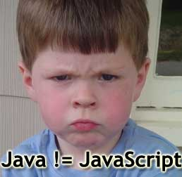

# JavaScriptで世界平和 2014 第001回

- 2014/04/15
- Pasta-K
  - pastak@kmc.gr.jp

## 準備物

### 必須

- インターネットブラウザ
  - 今後の進行の都合でGoogle Chrome推奨です
    - [http://www.google.co.jp/intl/ja/chrome/browser/](http://www.google.co.jp/intl/ja/chrome/browser/)
    - 基本的にはGoogle ChromeのStable最新版を用いて説明します。
  - Mozilla Firefoxを使っても良いよ
    - [http://getfirefox.jp](http://getfirefox.jp)

### 追々必要になる

- GitHubアカウント
  - 資料とか今後使うことがあると思われるので作っておいてください
    - [https://github.com/join](https://github.com/join)
- Git
  - [http://git-scm.com/downloads](http://git-scm.com/downloads)

これらの使い方について

- [kmc-jp/git_hands_on](https://github.com/kmc-jp/git_hands_on)
- [Home · kmc-jp/git_hands_on Wiki](https://github.com/kmc-jp/git_hands_on/wiki)
- GWくらいに別途勉強会をやる予定です〜

## この勉強会について

1. JavaScriptを用いて、 **コーディングに慣れる**
  - まずはこれ
2. ブラウザ拡張、WebAppsを作る
  - 慣れてきたら徐々にこの辺に
3. 世界平和


## 今日のお品書き

1. JavaScriptについて
2. JavaScriptを実行してみる

## JavaScriptについて

### JavaScriptとは？

- JavaScript は元々、ブラウザ向けスクリプト言語として開発された。今は ECMAScript として標準化され、ブラウザに限らず様々な所で使われている。
- 最初は画面をチカチカさせるくらいしか用途がないと思われてた。
- Google MapsとかJavaScriptでかっこいいWebアプリケーションが公開されるようになってから見直されるように

### JavaScript !== Java



<blockquote>
LiveScriptを開発したネットスケープ社とJavaを開発したサン・マイクロシステムズは当時協業関係にあった。
そのため、Javaアプレットのようにブラウザ上で動的なページが作れる言語、ということでJavaScriptと名称変更してしまった。
</blockquote>

[wise9 › JavaとJavaScriptの20年戦争](http://wise9.jp/archives/2245)

### ECMAScriptについて

商標etcの関係で言語仕様は`ECMA Script`という名称になっています。

#### ECMAScriptの歴史

 - 現行はver5.1
    - [http://www.ecma-international.org/ecma-262/5.1/](http://www.ecma-international.org/ecma-262/5.1/)
 - ECMAScript 6が準備中
 - JavaScriptやAcrionScriptはECMAScriptの方言
    - ActionScriptは当時策定中だったES4に準拠
    - その後ES4はまとまらずにES3.1に集中することに
    - 当時ES4に入っていた名前空間やパッケージなどがES3.1以降にも含まれないことに
    - ES3.1からES4を飛ばして次期バージョンがES5に

JavaScriptとECMAScriptについてもっと知りたい→[JavaScript小史 // Speaker Deck](https://speakerdeck.com/badatmath/javascript)

## JavaScript実装いろいろ


### PC向けブラウザ

|ブラウザ名           |開発元   |エンジン         |その他   |
|-:-                  |-:-      |-:-              |:--|
|Internet Explorer 6  |Microsoft|Trident          |(´・ω・\`)|
|IE 7                 |Microsoft|Trident          |(´・ω・\`)        |
|IE 8                 |Microsoft|Trident/4.0      |Web準拠始まる|
|IE 9                 |Microsoft|Trident/5.0      |HTML5とCSS3頑張る|
|IE 10                |Microsoft|Trident/6.0      |Windows8!!!!!!!!|
|IE 11                |Microsoft|Trident/7.0      |`MSIE`との決別|
|Mozilla Firefox      |Mozilla  |Gecko + *Monkey  |最新版は27.0.1（2014/02/13）|
|Google Chrome ver27- |Google   |Webkit + V8      |自動アップデート機構で死滅しているはず|
|Google Chrome ver28+ |Google   |Blink + V8       |最新版は32.0.1700.107（2014/02/03）|
|Opera ver 12-        |Opera    |Presto           |IEやNetscapeに対向する第3局。携帯電話などにもOpera派生ブラウザがよく搭載されていた。|
|Opera ver 14         |Opera    |WebKit           |詳細は小噺に|
|Opera ver 15+        |Opera    |Blink + V8       |最新版は19.0.1326.63（2014/02/13）|
|Safari               |Apple    |Webkit           |Windowsは5.1.xまで提供。最新版は7.0.1（2013/12/16）|

#### 小噺

 - [Opera、ブラウザーエンジンを“WebKit”“V8”へ移行する計画を明らかに - 窓の杜](http://www.forest.impress.co.jp/docs/news/20130213_587627.html)
    - 2013/02/13
 - [Google、WebKitに代わる新レンダリングエンジン「Blink」を発表 - ITmedia ニュース](http://www.itmedia.co.jp/news/articles/1304/04/news037.html)
    - 2013/04/03
 - [Opera、“Chromium”ベースに生まれ変わった「Opera Next 15」を公開 - 窓の杜](http://www.forest.impress.co.jp/docs/news/20130528_601225.html)
    - 2013/05/28

開発リソースなどの問題を解決するためにWebKitへの移行を発表。WebKit陣営はApple,GoogleにOperaが加わる形に。
2ヶ月後にGoogleがWebKitを離れて独自エンジンBlinkを発表し、Google Chromeで採用。Operaはこれに追随しWebKitを離れる。
その1ヶ月半後にChromium（Google Chromeのエンジン部分を切り出したオープンソースプロジェクト）をベースにしたOpera Nextを公開。

### スマートフォン向け

- ベースエンジンが同じでも色々事情があるケースがある

|ブラウザ名        |搭載OS |ベースエンジン|備考|
|:--               |-:-    |-:-       |:--|
|Safari            |iOS    |WebKit    | - |
|ブラウザ          |Android|WebKit    |いわゆる「標準ブラウザ」|
|Chrome            |iOS    |WebKit(?) |iOS向けにブラウザは作れないので、WebKitをアプリに埋め込んでゴニョゴニョ|
|Chrome            |Android|Blink + V8|Android向けのChromeはBlinkもV8も積んでる。最近のAndroidはこっちが標準で入ってる|
|Opera Mini        |iOS    |???       |一度サーバサイドでレンダリングした情報を端末で取得し表示するため、レタリングエンジンが非搭載|
|Opera             |Android|Blink + V8||
|Internet Explorer |WindowsPhone|Trident|そのままフルサポート|

### その他

|機種名          |搭載ブラウザ|備考|
|:--             |-:-|:--|
|Wii             |Opera              |『インターネットチャンネル』|
|ニンテンドーDS  |Opera              |『ニンテンドーDSブラウザー』|
|ニンテンドーDSi |Opera              |『ニンテンドーDSiブラウザー』|
|Wii U           |NetFront Browser NX|[Wii U｜インターネットブラウザーの主な仕様｜Nintendo](http://www.nintendo.co.jp/wiiu/hardware/features/internetbrowser/browser/)|
|ニンテンドー3DS |NetFront Browser NX|[インターネットブラウザーの主な仕様](http://www.nintendo.co.jp/3ds/hardware/features/browser.html)|
|PlayStation 3   |WebKit             |-|
|PlayStation Vita|WebKit             |-|

`NetFront Browser NX`は組み込み用のブラウザでWebKitをベースに開発されている。

## インターネットで検索するときについて

 - ブラウザによって色々ある
 - 変化がめっちゃ早い
    - 数年前の情報は怪しいかもしれない（古いことがある）
 - そもそも間違ってる、あてにならない ** 初心者向け情報 ** も多い
 - JavaScript自体の文法についてはMDNのリファレンス見れば大体どうにかなる
    - メンテナンスが細かいので（ある程度）信頼できる
    - https://developer.mozilla.org/ja/docs/Web/JavaScript/Reference


## JavaScriptを実行しよう

- Chromeの「開発者ツール」上で実行する
  - `メニュー` → `ツール` → `JavaScriptコンソール`
  - `ctrl` + `enter`で改行できる

## 実際のコードを実行してみよう

#### 計算する

```javascript
1+1
10-7
8*391
921/3
1913*(301313+136839)
```
### 文字を扱う

```javascript
hello
```

これはエラーが出る（はず）

**文字列は`'`または`"`で囲う**

```javascript
'hello'
```

```javascript
"世界平和"
```

```javascript
"JavaScript"+"で世界平和"+"2014"
```

```javascript
"あいうえおかきくけこさ".length
//=> 11
```

### 関数を利用する

```javascript
alert('hello');
```

### htmlを操作する

```javascript
document.body.style.background = 'pink';
```

### 配列

- データをひとまとめにした集合のようなもの

```javascript
['apple','banana','melon']
```

- 添字で要素にアクセスする
  - `0`から始まるので注意

```javascript
['apple','banana','melon'][0]
//=> 'apple'
['apple','banana','melon'][2]
//=> 'melon'
```

```javascript
['はまち','まぐろ','いなり','なっとう'].length
//=> 4
['はまち','まぐろ','いなり','なっとう'].sort()
['いなり','こんこん','恋いろは'].join();
[2014,4,15].join('/');
```

### 変数

- データに名前を付けて記録しておく
- データを便利に使いまわせる

```javascript
var fruits = ['apple','banana','melon'];
fruits[0]
//=> 'apple'
fruits[2]
//=> 'melon'
```

- 上書きできる

```javascript
var name = 'pastak';
alert('hello, '+name);
name = 'tyage';
alert('hello, '+name);
```

## 次回予告

- 次回からもう少し本格的にコードを読み書きしていきます。
- 慣れるまでがんばろう

## FizzBuzzプログラムを読んでみよう

- 3の倍数: `Fizz`
- 5の倍数: `Buzz`
- 15の倍数: `FizzBuzz`
- それ以外: その数字自身

## コード

```javascript
function fizzbuzz(lastNum){
  var i = 1;
  while(i <= lastNum){
    if(i%15 === 0){
      console.log('fizzbuzz');
    }else if(i%3 === 0){
      console.log('fizz');
    }else if(i%5 === 0){
      console.log('buzz');
    }else{
      console.log(i);
    }
    i = i+1;
  }
}
```

- `fizzbuzz(10)`
- `fizzbuzz(60)`
