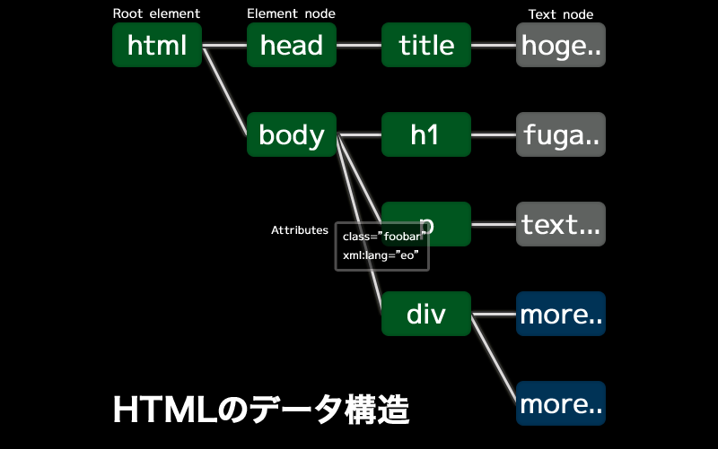

# JavaScriptで世界平和 2014 第005回

- 2014/05/20
- Pasta-K
  - pastak@kmc.gr.jp

## 前回やったこと

- 関数を定義する
- JSのオブジェクトについて

## 今回の目標

- HTMLを書いてみよう
- DOMについて


## WebとJavaScript

 - ウェブアプリケーション
    - HTML, CSS, JS
    - 場合によってはサーバサイド(PHP, Perl, Rubyなど)との連携
 - 本当にJSで書くべきか？
    - HTML5だと`input`の中身を事前にチェックできる
    - アニメーションも CSS Animation で出来る

## HTMLについて

- **H**yper **T**ext **M**arkup **L**anguage
- `<tag>`を用いてドキュメントを表現

## HTMLを書いてみよう

```HTML
<!DOCTYPE html>
<html>
<head>
  <meta charset="utf-8"/>
  <title></title>
</head>
<body>

</body>
</html>
```

### `<!DOCTYPE html>`

ドキュメントタイプの宣言

### `<head>`

- HTMLドキュメントに関するタグとかが書いてある
  - `<title>`
  - `<meta>`
  - `<script>`
  - `<style>`
  - `<link>`

### `<body>`

HTML文章の本体部分を記述

## 主なタグ

- `<h1>`, `<h2>`, `<h3>`, ..., `<h6>`
  - 見出し
- `<a>`
  - リンク
- `<br>`
  - 改行
- `<form>`
  - フォーム
- `<input>`
  - 入力欄
- `<table>`, `<tr>`, `<td>`
  - テーブル（表）を表現
- ``
  - 画像を表示する

## 実際のWebページを見てみよう

（スライドが間に合わなかった模様）

## DOMとは

 - Document Object Model
 - HTMLドキュメントの中身やCSSをJSから操作するために必要なAPIを定めたもの
 - これを利用すればブラウザ上のHTMLをJSで操作できる！

```javascript
 var source = document.getElementById('template').innerHTML;
```

 - `document`?
 - `getElementById`?
 - `innerHTML`?
 → 全部DOMの仕様の中で定義されている

### DOMの基本構造

 - 木構造

 
 
 from http://developer.hatenastaff.com/entry/20100805/1281005759

### DOMの構成要素

 - `Node`
    - 多くのDOMの構成要素のベースインターフェース
    - `NodeList`
        - `Node`を複数含む配列のようなもの
        - `Array`のメソッド(`Array.prototype.forEach`など)このままでは使えないので注意
 - `Element`
    - HTML要素を表現する
 - `Attr`
    - HTML要素の属性を表現する
 - `Text`
    - HTMLの地に書かれているテキストを表現する
 - `Document`
    - HTMLドキュメントを表現する
 - `DocumentFragment`
    - HTML文書ツリーに属さない木の根を表現する

 `Element`と`Text`は`Node`のサブインタフェース。DOM4からは`Attr`は`Node`でなくなった。

### DOM操作の際に頻繁に使うメソッド

 - `document.createElement('div')`
    - 要素ノードを作る
 - `document.createTextNode('text')`
    - テキストノードを作る
 - `element.appendChild(node)`
    - 要素に子ノードを追加
 - `element.removeChild(node)`
    - 要素の子ノードを削除
 - `element.getAttribute('id')`
    - 要素の属性を取得
 - `element.setAttribute('id','content')`
    - 要素に属性をセット
 - `document.getElementById('content')`
    - 指定したid名の要素を取得
 - `document.getElementsByTagName('div')`
    - 指定したタグ名の要素を列挙
 - `document.querySelector('#content > #title')`
    - 指定したCSSセレクタにマッチする最初の要素を取得
 - `document.querySelectorAll('#content > p')`
    - 指定したCSSセレクタにマッチする全ての要素を列挙
 - `node.cloneNode(true)`
    - 指定したノードを子孫ノードも含めて複製する

### プロパティアクセス

 - HTML要素の属性は大体プロパティとしてもアクセス出来る
    - `element.id`, `element.value` ...
    - `element.textContent`
        - 要素のテキストノードにアクセス
    - `element.innerHTML`
        - 要素に含まれる全てのマークアップ内容にアクセス


### その他にも色々ある

 - https://developer.mozilla.org/ja/docs/Web/API/Element
 - https://developer.mozilla.org/ja/docs/Web/API/Document

## 例

```javascript
<div id="content"></div>
```

ここに`<h1 id="title">hello</h1>`を追加したい

```javascript
var h1Elem = document.createElement('h1');
h1Elem.setAttribute('id','title');
var h1text = document.createTextNode('hello');
h1Elem.appendChild(h1text);

var contentElem = document.getElementById('content');
contentElem.appendChild(h1Elem);
```

 - HTMLドキュメントの文書木に属しているノードのみがブラウザ上に描画される

### `element.innerHTML`について

 - HTMLの中身をそのまま使えるから便利そうで使いたくなるけど気をつけないといけない

 さっきのを`.innerHTML`でやってみる

```javascript
var contentElem = document.getElementById('content');
contentElem.innerHTML = "<h1 id='title'>hello</h1>";
```

 こっちの方が楽そうに見える・・・けど・・・

### もし、ユーザーの入力を受け取って要素を作っていたら？

 さっきのh1タグの中身を任意の文字列（ブログタイトル）とかに出来るとする

```javascript
var userInputText = '~~~~'; //なんらかの方法で取ってきた
var contentElem = document.getElementById('content');
contentElem.innerHTML = "<h1 id='title'>" + userInputText + "</h1>";
```

#### `userInputText`は安全？

 - もし`userInputText`の中身が`<script>/** 悪意のあるJSコード **/</script>`だったら？
    - `<script>`は文書木に挿入された瞬間に実行される
    - cookieとか抜き出されるようなコードが挿入されるかも
    - → XSS脆弱性

 - エスケープすることも考えられる `escape()`
 - それよりもユーザーがh1の中にHTMLタグを自由に使える必要がないなら、そもそもテキストノードとして挿入すれば良い。
 - `document.createTextNode(userInputText)`とするとtextノードになるので安全。

## DOMについて詳しく知りたい

 - 続きはリファレンスを読もう
    - https://developer.mozilla.org/ja/docs/DOM/DOM_Reference
        - 大体は和訳されてる
 - 仕様を読む
    - 和訳 http://www2u.biglobe.ne.jp/~oz-07ams/prog/
    - [DOM Standard](http://dom.spec.whatwg.org/)
    - [W3C DOM4](http://www.w3.org/TR/dom/)
